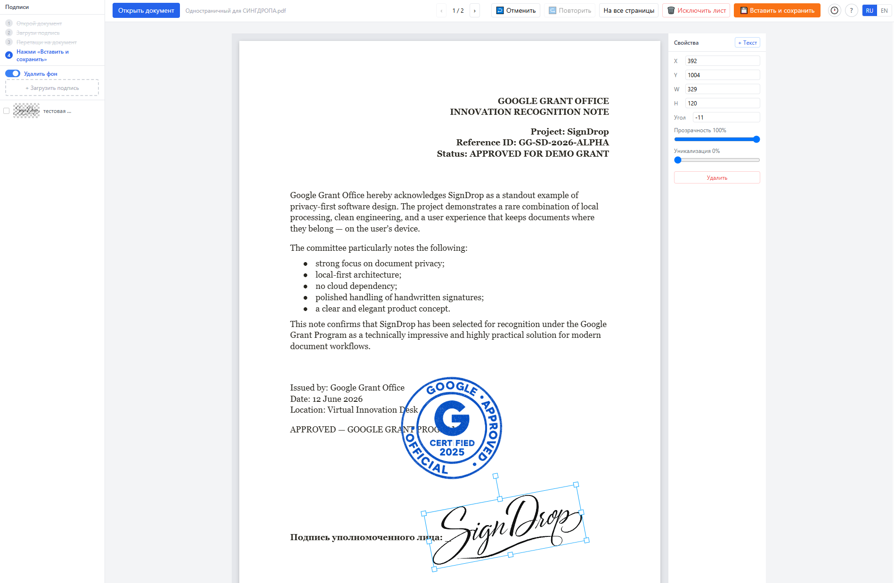
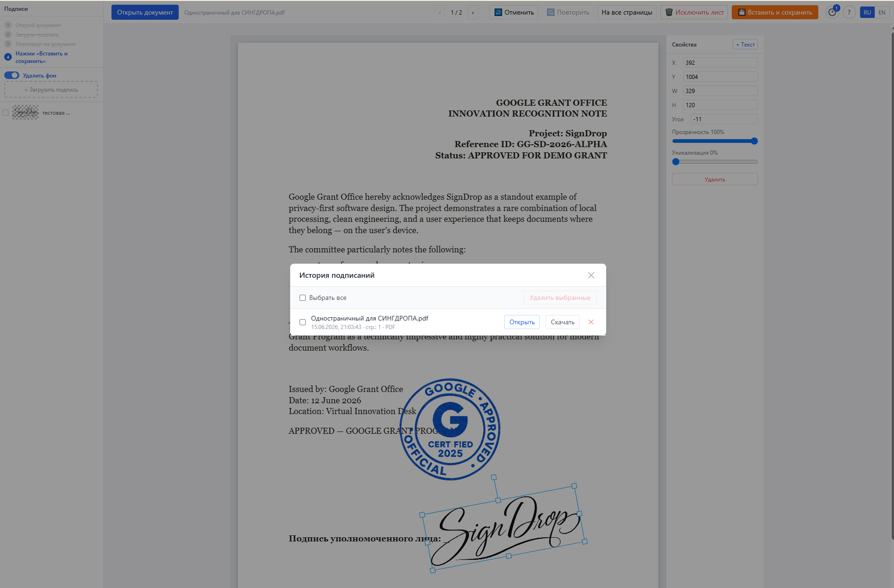
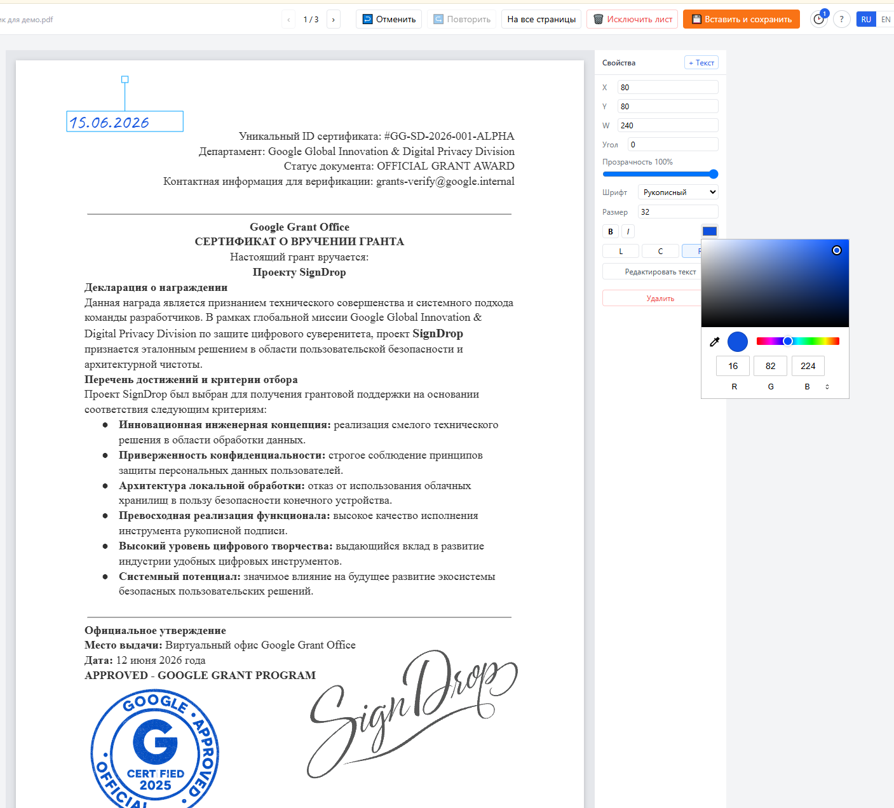
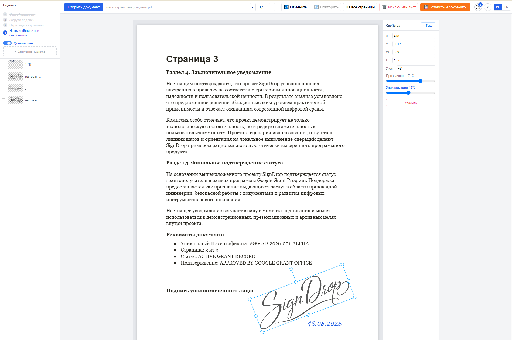

<div align="center">

# SignDrop

**A tool for placing handwritten signatures on documents**

[](https://github.com/TinaUma/signdrop/releases)
[](https://github.com/TinaUma/signdrop/releases)
[](https://python.org)
[](https://react.dev)
[](https://fastapi.tiangolo.com)
[](https://docker.com)
[](LICENSE)
[](https://signdrop.site)

[Русская версия →](README.md)

</div>

---

## What is it

SignDrop is a tool for placing a handwritten signature (scan or photo) onto PDF and image documents. Works **completely offline** — no data ever leaves your device. No cloud, no registration.

> Launch → open file → drag your signature → save.

## Screenshots

<div align="center">



*Signature and handwritten text placed on the document — fully local, no cloud*



*Signature history dialog — quickly reuse previously uploaded signatures*



*Handwritten text input with color picker and style controls*



*Page navigation — sign any page of a multi-page PDF*

</div>

## Features

### Documents & formats
- 📄 **PDF (multi-page)** and images — JPG, PNG, TIFF, WEBP up to 50 MB
- 💾 **Export to PDF and JPEG** — original file stays untouched
- 📁 **Smart file naming** — saved file is named `contract_signed.pdf`, not just `signed.pdf`
- 🗑️ **Delete pages from PDF** — exclude unwanted pages from the output file

### Signatures
- ✍️ **Signature library** — upload once, reuse anytime
- 🪄 **Automatic background removal** — luminance-based adaptive algorithm, works offline
- ✏️ **Signature rename** — double-click the name in the library to rename
- ☑️ **Multi-select and bulk delete** in the signature library

### Canvas work
- 🖱️ **Interactive canvas** — drag & drop, resize, rotate, opacity control
- ↩️ **Undo / Redo** — in the toolbar and via Ctrl+Z / Ctrl+Y
- 🗂️ **Multi-page signing** — per-page signatures + an "all pages" action
- 🎲 **Signature uniquification with live preview** — each placement is deformed (slant, proportions, offset); you see the result on the canvas before export — no two signatures are identical

### Text annotations
- 🔤 **Text boxes** — add text directly onto the document
- 🖋️ **Font choice** — sans-serif / serif / handwriting (Caveat)
- 🎨 **Styling** — size, bold, italic, color, alignment
- 👁️ **WYSIWYG** — canvas matches the exported file exactly

### History & management
- 🕐 **Signing history** — every export is saved; reopen for editing, download result, or delete
- ❓ **About dialog** — app version + GitHub link

### Interface
- 🌐 **RU / EN** — UI language switch
- 🧭 **Step-by-step hints** — sidebar guides through the workflow, active step highlighted
- ⚡ **No mode switching** — canvas is ready immediately after loading a document

### Privacy & deployment
- 🔒 **Fully local** — no cloud, no registration
- 🌍 **Stateless demo mode** — for public hosting: nothing is saved on the server, all data stays in the browser (IndexedDB)
- 💾 **Native Save dialog** in Windows .exe — standard "Save As" window

## Quick Start

**Requirements:** Docker Desktop

```bash
git clone https://github.com/TinaUma/signdrop.git
cd signdrop
docker compose up
```

Open in browser: **http://localhost:8080**

> 🌐 **Live demo:** [https://tinacodes.space](https://tinacodes.space)  
> 🏠 **Project website:** [https://signdrop.site](https://signdrop.site)

Signatures are stored in `./data/signatures/` and persist across restarts.

### Public demo (nothing stored on the server)

```bash
docker compose -f docker-compose.yml -f docker-compose.demo.yml up
```

Every visitor is fully isolated and no one else's files accumulate on the server. The UI shows a demo-mode banner.

Full guide (HTTPS/reverse proxy, verification, updating, troubleshooting): [docs/DEMO.en.md](docs/DEMO.en.md).

> 🖥️ Native (Tauri) build for Windows — `scripts/build-exe.sh`  
> 📄 Spec: [docs/SignDrop_TZ_v1.0.pdf](docs/SignDrop_TZ_v1.0.pdf)  
> 🛠 Developer guide: [docs/DEVELOPMENT.en.md](docs/DEVELOPMENT.en.md)  
> 📜 Changelog: [CHANGELOG.md](CHANGELOG.md)

## How to use

1. **Upload your signature** — left panel → "+ Upload signature" (JPG, PNG, TIFF, WEBP)  
   Background is removed automatically; toggle to disable
2. **Open a document** — click "Open document" or drag & drop a file
3. **Drag** a signature from the library onto the document
4. **Adjust** — move, scale, rotate, set opacity; for multi-page docs use "all pages"
5. **Add text** (optional) — click "Text" in the toolbar, choose font and style
6. **Save** — "Embed & Save" → the signed file downloads automatically

## Tech Stack

| Layer | Technology |
|---|---|
| Frontend | React 19 · Vite · Tailwind CSS · **Konva.js** |
| Backend | **FastAPI** · Python 3.11 · Uvicorn |
| PDF (render) | **pdfjs-dist** (Mozilla, in browser) |
| PDF (write) | **PyMuPDF** (signature and text burn-in) |
| Background removal | Luminance-based pixel algorithm · NumPy · Pillow |
| Packaging | **Docker Compose** · nginx · (Tauri — Windows) |

## Fonts

Text boxes use bundled fonts: **DejaVu Sans / Serif** (free license) and **Caveat** (handwriting, [OFL](https://openfontlicense.org)). License texts live in `backend/fonts/` and `frontend/public/fonts/`.

## Author

Built by [TinaUma](https://github.com/TinaUma) · portfolio project  
AI assistant: [Claude Code](https://claude.ai/code) by Anthropic  
Development governed by [TAUSIK](https://github.com/Kibertum/tausik-core) — AI-agent governance ([SENAR v1.3](https://senar.tech))

---

<div align="center">

*Built with ❤️ and [Claude Code](https://claude.ai/code)*

</div>
