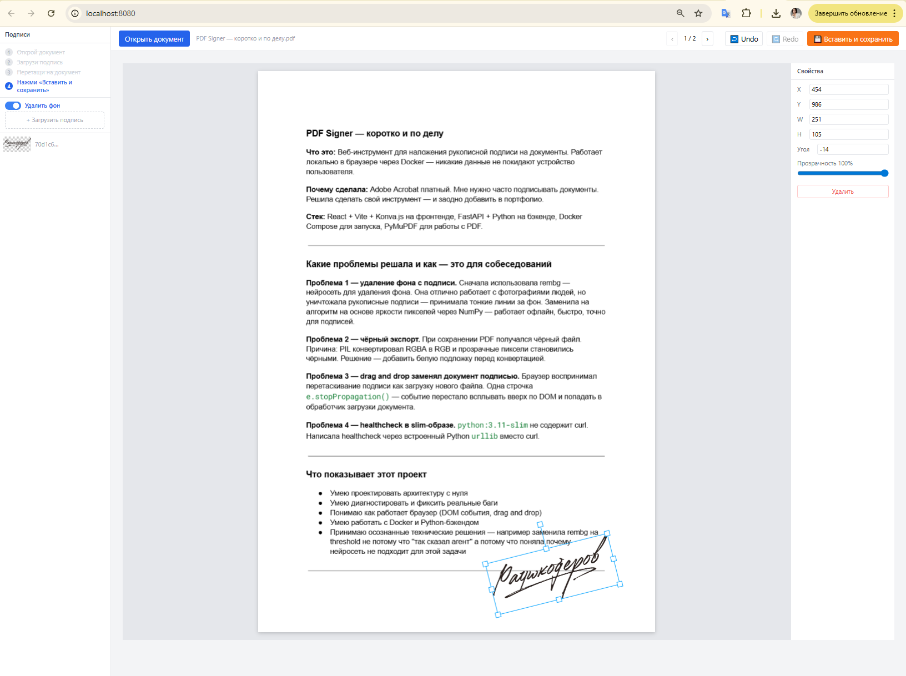

<div align="center">

# PDF Signer

**Инструмент для наложения рукописной подписи на документы**  
**A tool for placing handwritten signatures on documents**

[](https://github.com/TinaUma/PDF_Signer)
[](https://python.org)
[](https://react.dev)
[](https://fastapi.tiangolo.com)
[](https://docker.com)
[](LICENSE)

[Русский](#русский) · [English](#english)

</div>

---

<a name="русский"></a>

## 🇷🇺 Русский

### Что это

PDF Signer — инструмент для наложения рукописной подписи (скан или фото) на документы PDF, JPEG, PNG. Работает **полностью локально** — никакие данные не покидают устройство. Без облаков, без регистрации.

> Запустил → открыл файл → перетащил подпись → сохранил.

### Скриншоты

<div align="center">



*Пошаговые подсказки в сайдбаре, канвас сразу готов к работе, кнопка экспорта активируется когда подпись размещена*


*Документ подписан — подпись точно в нужном месте*


*Поворот, масштаб, прозрачность — полный контроль*

</div>

### Возможности

- 📄 PDF (многостраничный) и изображения — JPG, PNG, TIFF, WEBP до 50 МБ
- ✍️ Библиотека подписей — загрузи один раз, используй всегда
- 🪄 Автоматическое удаление фона — адаптивный алгоритм на основе яркости, работает офлайн
- 🖱️ Интерактивный холст — drag & drop, resize, **rotate**, прозрачность
- ↩️ Undo / Redo — в тулбаре и через Ctrl+Z / Ctrl+Y
- 💾 Экспорт PDF и JPEG — оригинал не изменяется
- 🧭 Пошаговые подсказки — сайдбар ведёт по шагам, активный шаг подсвечен
- ⚡ Без переключения режимов — канвас готов сразу после загрузки документа
- 🔒 Всё локально — никаких облаков, никакой регистрации

### Быстрый старт

**Требования:** Docker Desktop

```bash
git clone https://github.com/TinaUma/PDF_Signer.git
cd PDF_Signer
docker compose up
```

Открыть в браузере: **http://localhost:8080**

Подписи сохраняются в `./data/signatures/` и не пропадают между перезапусками.

### Как пользоваться

1. **Загрузи подпись** — левая панель → «+ Загрузить подпись» (JPG, PNG)  
   Фон удалится автоматически, можно отключить тумблером
2. **Открой документ** — кнопка «Открыть документ» или перетащи файл
3. **Режим подписи** — нажми «Разместить свою подпись»
4. **Перетащи** подпись из библиотеки на документ
5. **Настрой** — двигай, масштабируй, крути, меняй прозрачность
6. **Сохрани** — «Вставить и сохранить» → скачается готовый файл

### Стек технологий

| Слой | Технология |
|---|---|
| Frontend | React 18 · Vite · Tailwind CSS · **Konva.js** |
| Backend | **FastAPI** · Python 3.11 · Uvicorn |
| PDF | **PyMuPDF** (рендер + запись) |
| Удаление фона | Алгоритм на основе яркости пикселей · NumPy · Pillow |
| Упаковка | **Docker Compose** · nginx |

### Автор

Разработано [Умашевой Т.](https://github.com/TinaUma) · портфолио-проект  
AI-ассистент: [Claude Code](https://claude.ai/code) by Anthropic

---

<a name="english"></a>

## 🇬🇧 English

### What is it

PDF Signer is a tool for placing a handwritten signature (scan or photo) onto PDF and image documents. Works **completely offline** — no data ever leaves your device. No cloud, no registration.

> Launch → open file → drag your signature → save.

### Screenshots

<div align="center">


*Step-by-step hints in sidebar, canvas ready immediately, export button activates once a signature is placed*


*Document signed — signature placed exactly where needed*


*Rotate, scale, opacity — full control*

</div>

### Features

- 📄 PDF (multi-page) and images — JPG, PNG, TIFF, WEBP up to 50 MB
- ✍️ Signature library — upload once, reuse anytime
- 🪄 Automatic background removal — luminance-based adaptive algorithm, works offline
- 🖱️ Interactive canvas — drag & drop, resize, **rotate**, opacity control
- ↩️ Undo / Redo — in the toolbar and via Ctrl+Z / Ctrl+Y
- 💾 Export to PDF and JPEG — original file stays untouched
- 🧭 Step-by-step hints — sidebar guides through the workflow, active step highlighted
- ⚡ No mode switching — canvas is ready immediately after loading a document
- 🔒 Fully local — no cloud, no registration

### Quick Start

**Requirements:** Docker Desktop

```bash
git clone https://github.com/TinaUma/PDF_Signer.git
cd PDF_Signer
docker compose up
```

Open in browser: **http://localhost:8080**

Signatures are stored in `./data/signatures/` and persist across restarts.

### How to use

1. **Upload your signature** — left panel → "+ Upload signature" (JPG, PNG)  
   Background is removed automatically; toggle to disable
2. **Open a document** — click "Open document" or drag & drop a file
3. **Sign mode** — click "Place your signature"
4. **Drag** a signature from the library onto the document
5. **Adjust** — move, scale, rotate, set opacity
6. **Save** — "Embed & Save" → the signed file downloads automatically

### Tech Stack

| Layer | Technology |
|---|---|
| Frontend | React 18 · Vite · Tailwind CSS · **Konva.js** |
| Backend | **FastAPI** · Python 3.11 · Uvicorn |
| PDF | **PyMuPDF** (render + write) |
| Background removal | Luminance-based pixel algorithm · NumPy · Pillow |
| Packaging | **Docker Compose** · nginx |

### Author

Built by [TinaUma](https://github.com/TinaUma) · portfolio project  
AI assistant: [Claude Code](https://claude.ai/code) by Anthropic

---

<div align="center">

*Built with ❤️ and [Claude Code](https://claude.ai/code)*

</div>
